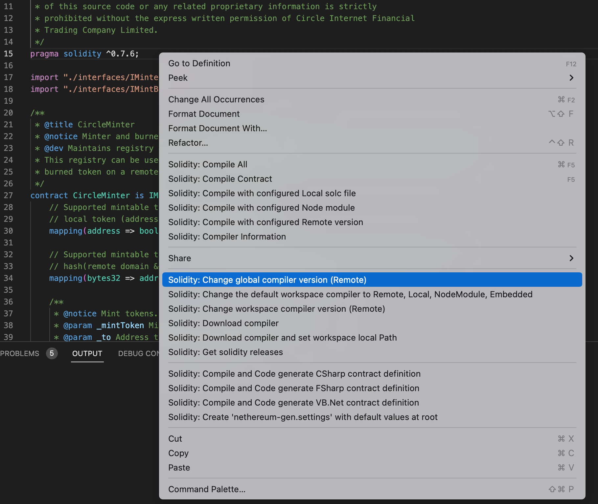

# evm-cctp-contracts

## Prerequisites

### Install dependencies
- Run `git submodule update --init --recursive` to update/download all libraries.
- Run `yarn install` to install any additional dependencies.

### VSCode IDE Setup
- Install solidity extension https://marketplace.visualstudio.com/items?itemName=juanblanco.solidity
- Navigate to a .sol file 
- Right-click, select `Solidity: Change global compiler version (Remote)`

- Select 0.7.6

- Install solhint extension https://marketplace.visualstudio.com/items?itemName=idrabenia.solidity-solhint

### Install Foundry
Install Foundry CLI (forge 0.2.0) from official [website](https://book.getfoundry.sh/getting-started/installation.html#on-linux-and-macos. ).

- To install a specific verison, see [here](https://github.com/foundry-rs/foundry/blob/3f13a986e69c18ea19ce634fea00f4df6b3666b0/foundryup/README.md#usage).

## Testing
### Unit tests
Run `forge test` to run test using installed forge cli or `make test` to run tests in docker container.

### Run unit tests with debug logs
Log level is controlled by the -v flag. For example, `forge test -vv` displays console.log() statements from within contracts. Highest verbosity is -vvvvv. More info: https://book.getfoundry.sh/forge/tests.html#logs-and-traces. Contracts that use console.log() must import lib/forge-std/src/console.sol.

### Integration tests
Run `make anvil-test` to setup `anvil` test node in docker container and run integration tests. There is an example in `anvil/` folder

### Linting
Run `yarn lint` to lint all `.sol` files in the `src` and `test` directories.

### Static analysis
Run `make analyze` to set up Python dependencies from `requirements.txt` and run Slither on all source files, requiring the foundry cli to be installed locally. If all dependencies have been installed, alternatively run `slither .` to run static analysis on all `.sol` files in the `src` directory.

### Continuous Integration using Github Actions
We use Github actions to run linter and all the tests. The workflow configuration can be found in [.github/workflows/ci.yml](.github/workflows/ci.yml)

### Alternative Installations

#### Docker + Foundry
Use Docker to run Foundry commands. Run `make build` to build Foundry docker image. Then run `docker run --rm foundry "<COMMAND>"` to run any [forge](https://book.getfoundry.sh/reference/forge/), [anvil](https://book.getfoundry.sh/reference/anvil/) or [cast](https://book.getfoundry.sh/reference/cast/) commands. There are some pre defined commands available in `Makefile` for testing and deploying contract on `anvil`. More info on Docker and Foundry [here](https://book.getfoundry.sh/tutorials/foundry-docker).

ℹ️ Note
- Some machines (including those with M1 chips) may be unable to build the docker image locally. This is a known issue.

## Deployment
The contracts are deployed using [Forge Scripts](https://book.getfoundry.sh/tutorials/solidity-scripting). The script is located in [scripts/deploy.s.sol](/scripts/deploy.s.sol). Follow the below steps to deploy the contracts:
1. Add the below environment variables to your [env](.env) file
    - `MESSAGE_TRANSMITTER_DEPLOYER_KEY`
    - `TOKEN_MESSENGER_DEPLOYER_KEY`
    - `TOKEN_MINTER_DEPLOYER_KEY`
    - `TOKEN_CONTROLLER_DEPLOYER_KEY`
    - `ATTESTER_ADDRESS`
    - `USDC_CONTRACT_ADDRESS`
    - `REMOTE_USDC_CONTRACT_ADDRESS`
    - `MESSAGE_TRANSMITTER_PAUSER_ADDRESS`
    - `TOKEN_MINTER_PAUSER_ADDRESS`
    - `MESSAGE_TRANSMITTER_RESCUER_ADDRESS`
    - `TOKEN_MESSENGER_RESCUER_ADDRESS`
    - `TOKEN_MINTER_RESCUER_ADDRESS`
    - `TOKEN_CONTROLLER_ADDRESS`
    - `DOMAIN`
    - `REMOTE_DOMAIN`
    - `BURN_LIMIT_PER_MESSAGE`

    In addition, to link the remote bridge, one of two steps needs to be followed:
    - Add the `REMOTE_TOKEN_MESSENGER_DEPLOYER` address to your [env](.env) file and run [scripts/precomputeRemoteMessengerAddress.py](/scripts/precomputeRemoteMessengerAddress.py) with argument `--REMOTE_RPC_URL` for the remote chain, which will automatically add the `REMOTE_TOKEN_MESSENGER_ADDRESS` to the .env file
    - Manually add the `REMOTE_TOKEN_MESSENGER_ADDRESS` to your .env file.

2. Run `make simulate RPC_URL=<RPC_URL> SENDER=<SENDER>` to perform a dry run. *Note: Use address from one of the private keys (used for deploying) above as `sender`. It is used to deploy the shared libraries that contracts use*
3. Run `make deploy RPC_URL=<RPC_URL> SENDER=<SENDER>` to deploy the contracts

## License
For license information, see LICENSE and additional notices stored in NOTICES.